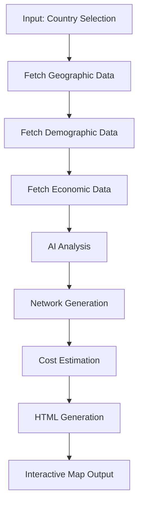

# Future Plans - AI-Powered Railway Network Generation

## Vision

Transform the Lebanon Railway Network Map from a single-country visualization into an **AI-powered railway network generator** that can learn from existing railway systems and automatically create optimal network designs for any country.

---

## Phase 1: Data Collection & Learning (Months 1-6)

### 1.1 Global Railway Dataset Creation
Build comprehensive dataset from successful railway networks worldwide:

#### Target Countries for Learning
- **Europe**: France (TGV), Germany (ICE), Spain (AVE), Switzerland (SBB)
- **Asia**: Japan (Shinkansen), China (CRH), South Korea (KTX)
- **Others**: UK, Italy, Netherlands, Belgium

#### Data Points to Collect
```javascript
{
    country: "France",
    network: {
        totalLength: 2734,
        highSpeedLength: 2657,
        stations: 3054,
        dailyPassengers: 5000000,
        topology: "radial-from-capital"
    },
    infrastructure: {
        tunnelRatio: 0.08,
        bridgeRatio: 0.05,
        elevatedRatio: 0.12,
        averageTunnelLength: 2.3,
        terrainAdaptation: "mountain-avoidance"
    },
    economics: {
        costPerKm: 15000000,
        passengerDensity: 1830,
        profitableRoutes: ["Paris-Lyon", "Paris-Marseille"]
    },
    technical: {
        gauge: 1435,
        electrification: "25kV-AC",
        signaling: "ERTMS",
        maxSpeed: 320
    }
}
```

### 1.2 Pattern Recognition System
Develop ML models to identify railway planning patterns:

```python
# Pseudo-code for pattern recognition
class RailwayPatternLearner:
    def learn_station_placement(self, countries_data):
        # Learn optimal station spacing
        # Population density correlation
        # Economic center identification
        
    def learn_route_optimization(self, terrain_data):
        # Terrain avoidance strategies
        # Cost vs. distance trade-offs
        # Engineering solution patterns
        
    def learn_network_topology(self, successful_networks):
        # Hub-and-spoke vs. mesh patterns
        # Capital city bias
        # Cross-border connections
```

---

## Phase 2: AI Model Development (Months 7-12)

### 2.1 Core AI Components

#### Terrain Analysis Model
```javascript
// Analyzes topographical data to suggest routes
const TerrainAnalyzer = {
    identifyChallenges: (elevationData) => {
        return {
            mountains: detectMountainRanges(elevationData),
            rivers: detectMajorRivers(elevationData),
            valleys: findNaturalCorridors(elevationData),
            coastalRoutes: identifyCoastalPaths(elevationData)
        };
    },
    
    suggestEngineering: (challenges) => {
        // If mountain > 500m elevation change → suggest tunnel
        // If river > 1km wide → suggest major bridge
        // If coastal & elevation < 50m → suggest elevated track
    }
};
```

#### Population & Economic Model
```javascript
// Determines station locations and line priorities
const DemographicAnalyzer = {
    identifyHubs: (populationData, economicData) => {
        return cities.filter(city => {
            return city.population > 100000 || 
                   city.gdpPerCapita > threshold ||
                   city.hasAirport || 
                   city.hasPort;
        });
    },
    
    calculateDemand: (origin, destination) => {
        // Gravity model for passenger demand
        const distance = calculateDistance(origin, destination);
        const demand = (origin.pop * destination.pop) / (distance * distance);
        return demand;
    }
};
```

#### Network Optimization Engine
```javascript
// Optimizes entire network design
const NetworkOptimizer = {
    generateNetwork: (country, constraints) => {
        const cities = identifyMajorCities(country);
        const pairs = generateCityPairs(cities);
        
        return pairs
            .map(pair => calculateOptimalRoute(pair))
            .filter(route => route.benefitCostRatio > 1.5)
            .sort((a, b) => b.priority - a.priority);
    },
    
    applyLearnings: (network, learnedPatterns) => {
        // Apply successful patterns from other countries
        // Adjust for local conditions
    }
};
```

### 2.2 HTML Generation Engine
```javascript
// Converts AI decisions into interactive HTML maps
class HTMLMapGenerator {
    constructor(countryData, aiNetwork) {
        this.country = countryData;
        this.network = aiNetwork;
    }
    
    generateHTML() {
        return `
<!DOCTYPE html>
<html>
<head>
    <title>${this.country.name} AI-Generated Railway Network</title>
    <link rel="stylesheet" href="https://unpkg.com/leaflet@1.9.4/dist/leaflet.css" />
    <style>
        /* Auto-generated styles based on country */
        ${this.generateStyles()}
    </style>
</head>
<body>
    <div id="map"></div>
    <div class="info-panel">
        <h2>${this.country.name} Railway Network</h2>
        <p>AI-Generated Optimal Design</p>
        <div class="stats">
            ${this.generateStats()}
        </div>
    </div>
    <script src="https://unpkg.com/leaflet@1.9.4/dist/leaflet.js"></script>
    <script>
        ${this.generateMapScript()}
    </script>
</body>
</html>
        `;
    }
    
    generateMapScript() {
        return `
        const map = L.map('map').setView([${this.country.center}], ${this.country.zoom});
        
        // Add base layer
        L.tileLayer('https://{s}.tile.openstreetmap.org/{z}/{x}/{y}.png').addTo(map);
        
        // Add AI-generated railway lines
        ${this.network.lines.map(line => this.generateLineCode(line)).join('\n')}
        
        // Add AI-placed stations
        ${this.network.stations.map(station => this.generateStationCode(station)).join('\n')}
        
        // Add AI-suggested infrastructure
        ${this.network.infrastructure.map(item => this.generateInfraCode(item)).join('\n')}
        `;
    }
}
```

---

## Phase 3: Implementation Pipeline (Months 13-18)

### 3.1 Automated Workflow



### 3.2 Input Requirements
```javascript
// Minimal input to generate a railway network
const generateRailwayNetwork = async (country) => {
    const input = {
        country: country,
        preferences: {
            networkType: "mixed", // high-speed, regional, mixed
            prioritize: "population", // population, tourism, freight
            budget: "optimal", // minimal, optimal, premium
            timeframe: 10 // years
        }
    };
    
    const geoData = await fetchGeographicData(country);
    const demoData = await fetchDemographicData(country);
    const econData = await fetchEconomicData(country);
    
    const aiNetwork = await AI.generateOptimalNetwork(
        geoData, 
        demoData, 
        econData, 
        input.preferences
    );
    
    return new HTMLMapGenerator(country, aiNetwork).generateHTML();
};
```

---

## Phase 4: Advanced Features (Months 19-24)

### 4.1 Multi-Modal Integration
```javascript
// Integrate with existing transport
const integrateTransport = {
    airports: connectToInternationalAirports(),
    ports: connectToMajorSeaports(),
    highways: createIntermodalHubs(),
    metro: integrateWithUrbanTransit()
};
```

### 4.2 Phased Construction Planning
```javascript
// AI suggests construction phases
const constructionPhases = {
    phase1: {
        years: "1-5",
        routes: ["highest-demand-corridors"],
        cost: "30% of total",
        returnOnInvestment: "fastest"
    },
    phase2: {
        years: "6-10",
        routes: ["secondary-connections"],
        cost: "40% of total"
    },
    phase3: {
        years: "11-15",
        routes: ["completeness-and-redundancy"],
        cost: "30% of total"
    }
};
```

### 4.3 Economic Impact Simulation
```javascript
// Predict economic benefits
const economicSimulation = {
    gdpImpact: calculateGDPBoost(network),
    jobCreation: estimateEmployment(network),
    carbonReduction: calculateEmissionsSaved(network),
    landValueIncrease: predictPropertyValues(network)
};
```

---

## Phase 5: Global Deployment (Months 25-30)

### 5.1 Web Platform Development
```
railway-ai-generator.com/
├── Home (explain concept)
├── Generate Network
│   ├── Select Country
│   ├── Set Preferences
│   ├── View AI Progress
│   └── Download HTML Map
├── Gallery (showcase examples)
├── Learn (how it works)
└── API (for developers)
```

### 5.2 API for Developers
```javascript
// RESTful API for network generation
POST /api/generate-network
{
    "country": "Morocco",
    "preferences": {
        "focus": "tourism",
        "includeFreight": true,
        "connectToEurope": true
    }
}

// Response
{
    "status": "completed",
    "network": {
        "lines": [...],
        "stations": [...],
        "cost": 14500000000,
        "distance": 1847
    },
    "htmlUrl": "https://cdn.railway-ai.com/morocco-network.html",
    "downloadUrl": "https://cdn.railway-ai.com/morocco-network.zip"
}
```

---

## Technical Architecture

### Backend Stack
- **Python**: Core AI/ML processing (TensorFlow/PyTorch)
- **PostGIS**: Spatial data processing
- **Redis**: Caching generated networks
- **Docker**: Containerized processing

### Frontend Stack
- **React**: Web interface
- **Leaflet**: Map rendering
- **D3.js**: Data visualizations
- **WebGL**: 3D terrain visualization

### Data Sources
- OpenStreetMap: Geographic data
- Natural Earth: Terrain data
- World Bank: Economic data
- UN: Population data

---

## Example Outputs

### 1. Morocco Railway Network
```javascript
// AI identifies Casablanca-Rabat-Tangier corridor as priority
// Suggests coastal route to avoid Atlas Mountains
// Connects to Spain via future Gibraltar tunnel consideration
```

### 2. Nigeria Railway Network
```javascript
// AI creates Lagos-Kano-Abuja triangle as core
// Suggests elevated tracks for Niger Delta region
// Prioritizes freight for agricultural transport
```

### 3. Vietnam Railway Network
```javascript
// AI enhances existing North-South railway
// Suggests high-speed upgrade Hanoi-Saigon
// Adds mountain tunnels for Danang connection
```

---

## Success Metrics

### Technical Metrics
- Generation time < 30 seconds
- Network optimization score > 85%
- Cost estimation accuracy ± 15%

### User Metrics
- 100+ countries generated
- 10,000+ maps created
- 90% user satisfaction

### Impact Metrics
- Used by 50+ transport ministries
- Influenced $100B+ in investments
- Reduced planning time by 80%

---

## Long-term Vision (5+ Years)

### 1. Real-time Updates
- Live traffic integration
- Dynamic route optimization
- Maintenance scheduling

### 2. Climate Adaptation
- Sea level rise considerations
- Extreme weather resilience
- Carbon neutral designs

### 3. Autonomous Integration
- Self-driving train compatibility
- Automated freight systems
- Predictive maintenance

### 4. Virtual Reality Planning
- VR station walkthroughs
- Immersive route planning
- Public consultation tools

---

## Open Source Strategy

### Repository Structure
```
railway-network-ai/
├── core/               # AI models
├── data-collectors/    # Data gathering scripts
├── generators/         # HTML generation
├── examples/          # Generated networks
├── docs/              # Documentation
└── web/               # Web interface
```

### Community Building
- Monthly virtual hackathons
- Railway planning workshops
- University partnerships
- Government collaborations

---

## Conclusion

This project will democratize railway planning by making sophisticated network design accessible to any country, regardless of their planning resources. By learning from successful systems and applying AI optimization, we can accelerate global railway development and create more connected, sustainable transportation networks worldwide.

The future of railway planning is not just digital—it's intelligent, adaptive, and accessible to all.